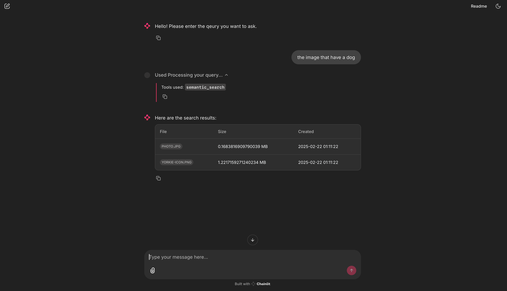

# Multi-Modal Natural Language Search System

This is a powerful application that enables natural language search capabilities for your files. The system combines semantic understanding with temporal awareness to provide an intuitive search experience.

## Key Features

- **Semantic Search**: Search files by name and content using natural language queries
  - Find files based on their meaning and context
  - Search through file contents intelligently
  - Natural language understanding for better results
- **Time-Based Search**: Filter files by creation date using natural language
  - Use queries like "pdfs I created in 2023"
  - Find recent files with "photos I added last week"
  - Temporal understanding of file modifications
- **File Type Search**: Smart file type detection and filtering
  - Search by file types naturally ("show me all PDFs")
  - Combine with other search criteria
- **Content Q&A**: Ask questions about file contents
  - Get direct answers from your documents
  - Extract specific information without reading entire files
  - Support for multiple file formats

## Prerequisites

- Docker and Docker Compose
- Elasticsearch 8.17.2
- Kibana 8.17.2

## Installation

1. Clone the repository:
```bash
git clone [repository-url]
cd [repository-name]
```

2. Create and activate a Conda environment:
```bash
conda create -n nls python=3.12
conda activate nls
```

3. Install dependencies:
```bash
pip install -r requirements.txt
```

Note: The `requirements.txt` file is generated with `pipreqs`. If you encounter any issues, you can manually install the required packages or install the latest versions as needed.

## Setup and Running

1. Start Elasticsearch and Kibana containers:
```bash
# Start Elasticsearch
docker run --name elasticsearch --net elastic -p 9200:9200 -e "xpack.security.enabled=false" -e "discovery.type=single-node" -t docker.elastic.co/elasticsearch/elasticsearch:8.17.2

# Start Kibana
docker run --name kibana --net elastic -p 5601:5601 -e "xpack.security.enabled=false" docker.elastic.co/kibana/kibana:8.17.2
```

2. Set up the Python environment:
```bash
export PYTHONPATH=$(pwd)  # Use absolute path of the project root
```

3. Process your files:
```bash
python processor/processor.py --folder_path ./sample_folder [--overwrite]
```

After processing, you can view the indexed files in Kibana at:
- Kibana Dashboard: [http://localhost:5601/app/home](http://localhost:5601/app/home)

4. Launch the application:
```bash
chainlit run app.py -w
```

## Usage Examples

Here's a walkthrough of the system's main features:

### 1. Main Interface

*Main search interface - Where you input your natural language queries*

### 2. Semantic Search

*Example of semantic search results - Finding content based on meaning*


*More semantic search results - Showing contextual understanding*

### 3. Time-Based Search

*Example of time-range search results - Finding files by creation or modification date*

### 4. File Type Search

*Example of file type search results - Smart filtering by file types*

### 5. Content Q&A

*Content analysis and Q&A feature*
